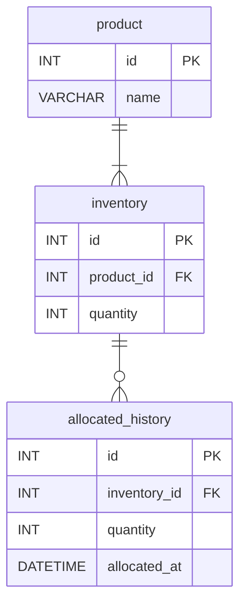

# 問題

# 概要

## 確かめたいこと

- 基本的な Typescript および Nodejs で API が作成できるかどうか
- 足りない知識を調べながら進められるかどうか
- 仕様の足りない箇所を想像して補完できるかどうか

## 見ていないこと

- きれいなコードかどうか

# 問題設定

- 在庫管理サービスのバックエンドの開発をしています
- 在庫の引当を行う API を作成してください

# API の仕様

### 概要

- 指定された製品に対して、指定された個数分の在庫引当を行います。
- 指定された個数分の在庫が存在する場合にのみ引当を行います。
- 複数人が同時に API コールを行う可能性があります。
- 在庫が負の数になることはありません。

| メソッド | URI                         |
| -------- | --------------------------- |
| POST     | `/api/inventories/allocate` |

### ER 図



### Request Body

| Key       | Type | Description       |
| --------- | ---- | ----------------- |
| productId | Int  | 引当を行う製品 ID |
| quantity  | Int  | 引当を行う個数    |

```json
{
  "productId": 123,
  "quantity": 10
}
```

### Response

ステータスコード

| Code |                      |
| ---- | -------------------- |
| 200  | 引当に成功           |
| 400  | バリデーションエラー |
| 404  | 製品が見つからない   |
| 500  | サーバーエラー       |

成功時

| Key          | Type   | Required | Description        |
| ------------ | ------ | -------- | ------------------ |
| product      | Object | Y        | 引き当てられた製品 |
| product.id   | Int    | Y        | 製品 ID            |
| product.name | String | Y        | 製品名             |
| quantity     | Int    | Y        | 引き当てられた個数 |
| remaining    | Int    | Y        | 残数               |

```json
{
  "product": {
    "id": 123,
    "name": "テスト製品"
  },
  "quantity": 10,
  "remaining": 90
}
```

失敗時

| Key     | Description      |
| ------- | ---------------- |
| code    | ステータスコード |
| message | エラーメッセージ |

ステータスコードについて

- 400 ⇒ BAD_REQUEST
- 404 ⇒ NOT_FOUND
- 500 ⇒ INTERNAL_SERVER_ERROR

エラーメッセージについては、指定がない場合適当に決めてしまってよいです。

```json
{
  "code": "INTERNAL_SERVER_ERROR",
  "message": "XXXに失敗しました"
}
```

### バリデーションについて

※基本的なバリデーションはあえて抜いてあります。可能な限り埋めて作ってみてください。
(エラーメッセージは自分で決めてよいです)

| バリデーション           | メッセージ                   | Code      |
| ------------------------ | ---------------------------- | --------- |
| 指定された製品 ID がない | 指定された製品が存在しません | NOT_FOUND |

### 初期投入データについて

Seeding が終わった段階で、以下のデータがそれぞれのテーブルに入った状態になります。下記のデータは自由に使用できます。

`products`

```json
{ "id": 1, "name": "テスト製品" }
```

`inventories`

```json
{ "id": 1, "productId": 1, "quantity": 100 }
```

## 使用するライブラリ

- next.js
- prisma (for database)
- zod(使いたければ)
